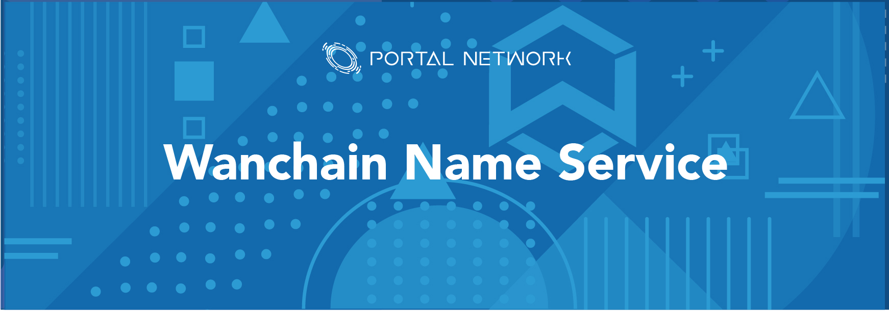

> 📖🔍 Documents and implementations for the Wanchain Name Service.

## 📝 Description

WNS is the Wanchain Name Service, a distributed, open, and extensible naming system based on the Wanchain blockchain.

## 🛠 Useful Tools

- WNS Explorer: [http://wns.portal.network](http://wns.portal.network)
- Wanchain Wallet: [https://wan.portal.network](https://wan.portal.network)
- Web Builder: [https://web.portal.network](https://web.portal.network)
- Marketplace: [https://beta.portal.network](https://beta.portal.network)

## 📚 Documents

#### Table of Contents
-  [Introduction](./docs/INTRODUCTION.md)
-  [Implementation](./docs/IMPLEMENTATION.md)
    - [Registry](./docs/REGISTRY.md)
    - [Registrar](./docs/REGISTRAR.md)
    - [Resolver](./docs/RESOLVER.md)
    - [ReverseRegistrar](./docs/REVERSE_REGISTRAR.md)
-  [Developer Guide](./docs/DEVELOPER_GUIDE.md)
-  [Integration](./docs/INTEGRATION.md)

## 📣 Contributing
See [CONTRIBUTING.md](./CONTRIBUTING.md) for how to help out.

## 🗒 Licence
See [LICENSE](./LICENSE) for details.
